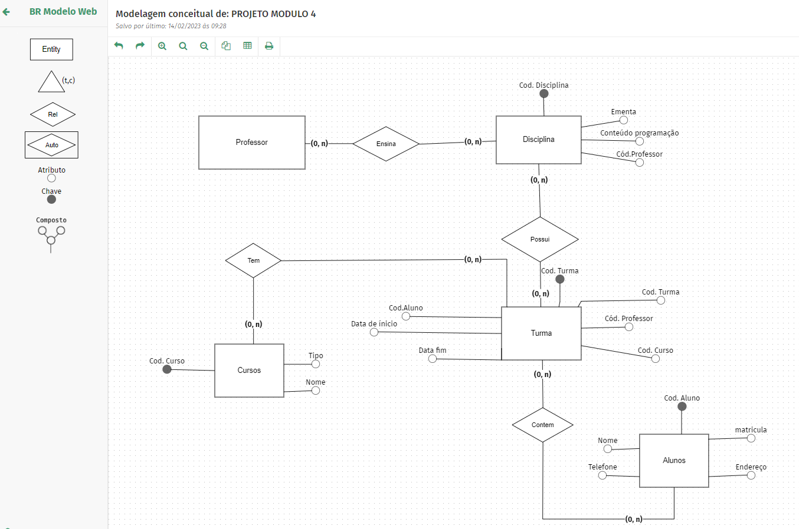
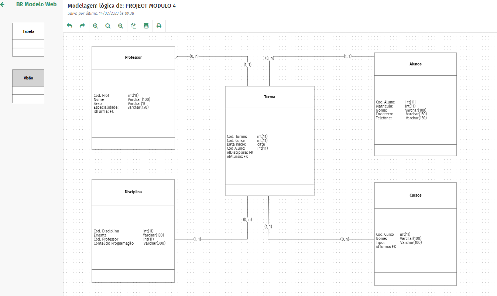

<b><big><big><big>{c:magenta}PROJETO INDIVIDUAL MODULO 4 </b></big></big></big>{/c}

A Resilia está pensando em lançar um novo sistema de acompanhamento e para isso precisa de ajuda para modelar um banco de dados que vai armazenar seus cursos, turmas e alunos.

O QUE É PARA FAZER?
Para apoiar nesse sistema recebemos a tarefa de realizar essa modelagem e responder algumas perguntas com nosso modelo:

Perguntas sobre o Modelo:
⇨ Existem outras entidades além dessas três?
Sim, foram acrescentadas mais 2 entidades

⇨ Quais são os principais campos e tipos?

curso: cod.curso, nome, tipo

aluno: cod.Aluno, nome, matricula, telefone, endereço 

turma: Cod.Turma, cod.Curso, Cod.Aluno, Data de inicio, Data fim, Cod.Professor.

Disciplina: Cod.Disciplina, ementa, Conteudo programação, Cod.Professor.

⇨ Como essas entidades estão relacionadas?
O professor ensina disciplina, que possui turmas que contem turmas e cursos no curso que tem alunos.

MODELO CONCEITUAL.

MODELO LÓGICO

